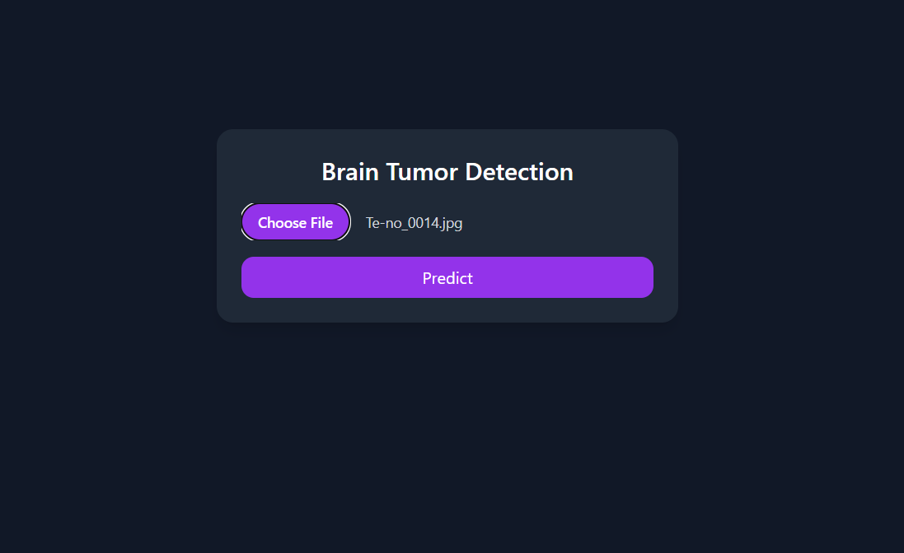
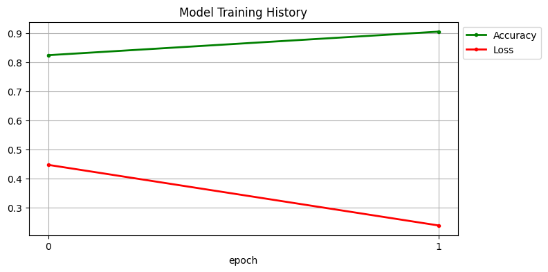
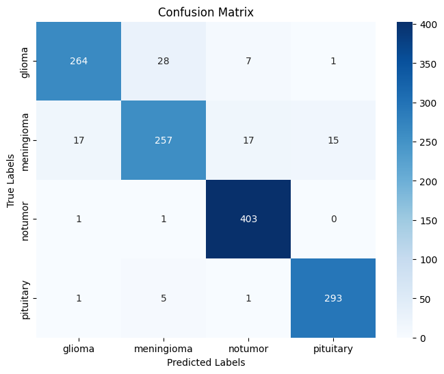
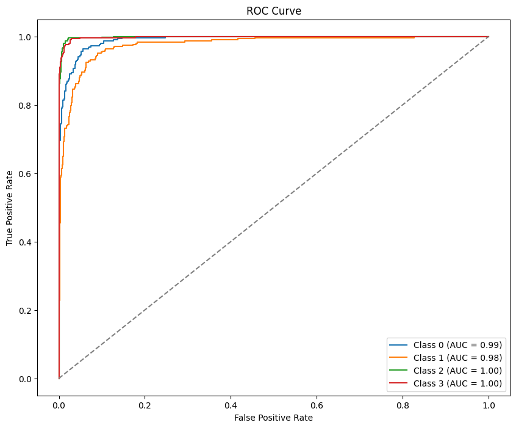
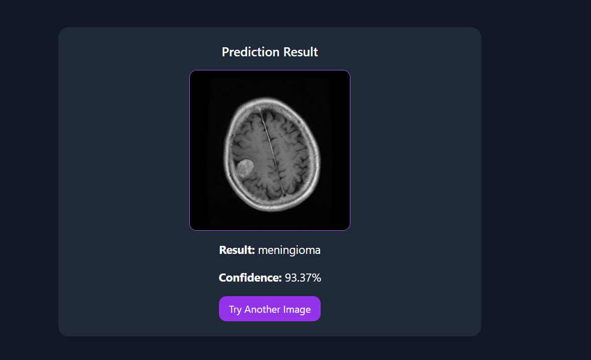

# 🧠 Brain Tumor Detection System 🏥



A deep learning-based system for detecting brain tumors from MRI scans with high accuracy. The system classifies MRI images into four categories: glioma, meningioma, no tumor, and pituitary tumor.

## ✨ Features

- 🖼️ Upload MRI images for instant tumor detection
- 📊 High accuracy predictions with confidence percentages
- 🚀 Fast inference using a pre-trained VGG16 model with transfer learning
- 📱 Simple web interface built with Flask

## 🧰 Technologies Used

- **Python** with TensorFlow/Keras for deep learning
- **Flask** for web application framework
- **VGG16** with transfer learning for image classification
- **NumPy** and **PIL** for image processing
- **scikit-learn** for model evaluation metrics

## 📈 Model Performance

### Training History


### Confusion Matrix


### ROC Curve


## 🏆 Prediction Examples

**No Tumor Detected**  


**Meningioma Detected**  


## 🛠️ Installation & Usage

1. Clone the repository:
```bash
git clone https://github.com/yourusername/brain-tumor-detection.git
cd brain-tumor-detection
