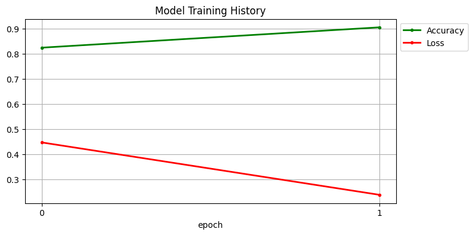
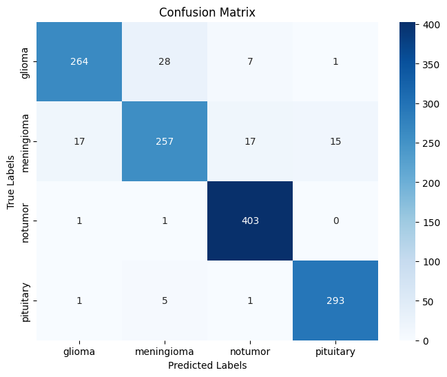
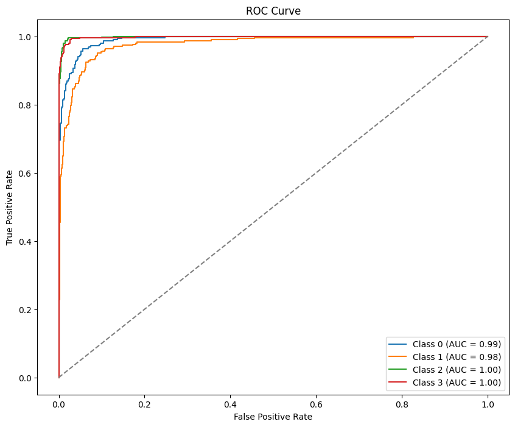
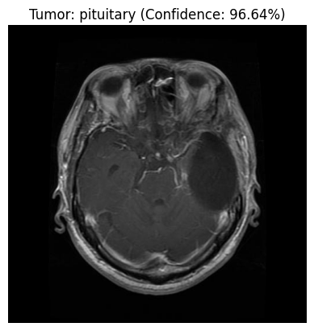
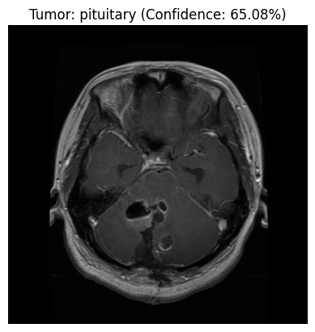

# 🧠 MRI Tumor Detection using CNN – A to Z Project Documentation

---

## A. About the Project
This project detects brain tumors from MRI scans using a Convolutional Neural Network (CNN). The goal is to automate the detection process and evaluate performance with robust metrics.

---

## B. Business Case / Problem Statement
- **Goal:** Automatically identify whether an MRI scan shows signs of a brain tumor.
- **Why:** Early detection saves lives and supports radiologists with decision-making.

---

## C. Collecting the Data
- **Dataset Source:** Public MRI dataset (e.g., Kaggle)
- **Classes:** Tumor, No Tumor
- **Format:** `.jpg` or `.png` MRI scan images
- **Structure:**
  ```
  data/
  ├── Tumor/
  └── NoTumor/
  ```

---

## D. Data Preprocessing
```python
import os
import cv2
import numpy as np
from sklearn.model_selection import train_test_split

path = 'data/'
img_size = 224
X, y = [], []

for label in os.listdir(path):
    for img in os.listdir(os.path.join(path, label)):
        img_arr = cv2.imread(os.path.join(path, label, img))
        img_arr = cv2.resize(img_arr, (img_size, img_size))
        X.append(img_arr)
        y.append(0 if label == "NoTumor" else 1)

X = np.array(X) / 255.0
y = np.array(y)

X_train, X_test, y_train, y_test = train_test_split(X, y, test_size=0.2, random_state=42)
```

---

## E. EDA (Exploratory Data Analysis)
- Checked distribution of tumor vs no-tumor
- Sample visualizations of MRI images (optional)
- No missing values, as image presence was ensured

---

## F. Model Building (CNN)
```python
import tensorflow as tf
from tensorflow.keras.models import Sequential
from tensorflow.keras.layers import Conv2D, MaxPooling2D, Flatten, Dense, Dropout

model = Sequential([
    Conv2D(32, (3,3), activation='relu', input_shape=(224,224,3)),
    MaxPooling2D(2,2),
    Conv2D(64, (3,3), activation='relu'),
    MaxPooling2D(2,2),
    Flatten(),
    Dense(128, activation='relu'),
    Dropout(0.3),
    Dense(1, activation='sigmoid')
])

model.compile(optimizer='adam', loss='binary_crossentropy', metrics=['accuracy'])
```

---

## G. Training the Model
```python
history = model.fit(X_train, y_train, epochs=10, validation_data=(X_test, y_test))
```

---

## H. Model Evaluation

### 1. Accuracy & Loss Graphs  


### 2. Confusion Matrix  


### 3. ROC Curve  


### 4. Classification Report (F1, Precision, Recall)
```python
from sklearn.metrics import classification_report

pred = model.predict(X_test)
pred = (pred > 0.5).astype(int)
print(classification_report(y_test, pred))
```

---

## I. Model Outputs / Predictions
  


---

## J. Deployment (Optional)
- Can be deployed using Flask + HTML/CSS UI
- Or integrated into a mobile app for field testing
- Expose model via REST API for predictions

---

## K. Learnings and Limitations
- CNN performs well with sufficient MRI data
- Could further improve with data augmentation and deeper architectures (ResNet, etc.)
- Interpretability of predictions can be enhanced using Grad-CAM

---

## Z. Summary
This project demonstrates a complete deep learning pipeline using CNN to detect brain tumors from MRI scans. With strong evaluation metrics and visual outputs, it can be deployed for real-world medical assistance.
